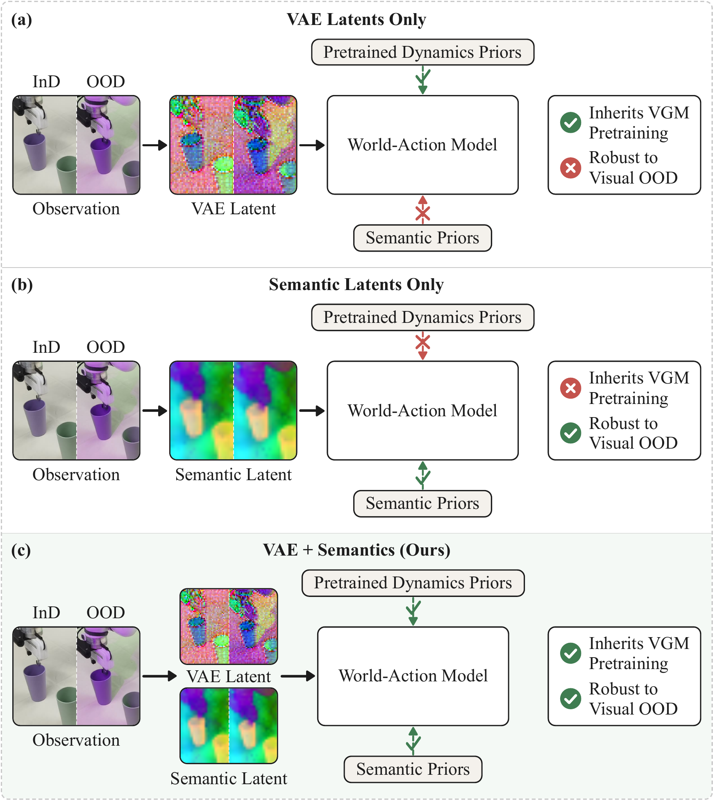
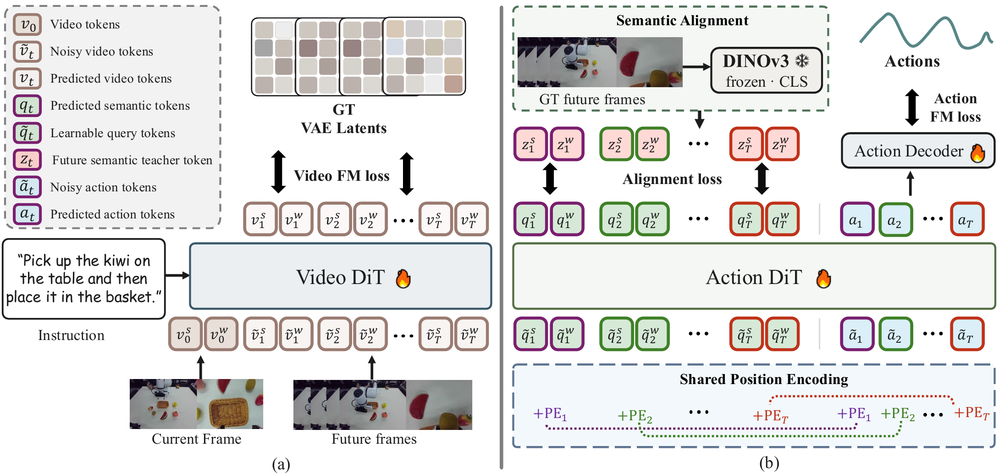

<div align="center">

# Robust-WAM: Bridging Generative Pretraining and Semantic Foresight in World-Action Models

[](https://arxiv.org/abs/2608.05903)
[](https://haodong-yan.github.io/robust-wam-project-page/)
[](./LICENSE)

Haodong Yan, Junfeng Li, Junjie He, Zhide Zhong, MingMing Yu, Wenxuan Song, Jiaguan Zhu, Yangyang Zheng, Yuqiao Du, Jiadi You, Yingjie Cai, Xu Yan, Guanyi Zhao, Bingbing Liu, Haoang Li

The Hong Kong University of Science and Technology (Guangzhou) &nbsp;·&nbsp; Beihang University &nbsp;·&nbsp; Huawei Foundation Model Department

</div>

**Robust-WAM** is a lightweight **post-training method** that makes video-generation World-Action Models (WAMs) robust to visual out-of-distribution (OOD) shifts, **without discarding the large-scale video-generation prior** they were built on. It keeps the WAM's VAE-based video-generation path untouched and injects appearance-invariant *semantic foresight* into the action stream, so the same policy stays reliable under lighting, background, camera, and sensor-noise changes.

The method is a **plug-in**: it adds a handful of learnable query tokens to the action stream and aligns them, during training only, to the frozen DINOv3 CLS features of future frames. At inference the teacher and the alignment head are dropped, and only the query tokens remain, so the overhead is negligible (≈ +0.016M parameters, ≈ 4% latency).

This repository provides faithful, runnable implementations on two action-expert WAM backbones:

| Folder | Backbone | Benchmark(s) | Train | Inference |
|---|---|---|---|---|
| [`geact-RW/`](./geact-RW) | GE-Act (LTX-Video) | LIBERO / LIBERO-Plus, Real robot | ✅ | ✅ |
| `fastwam-RW/` *(coming soon)* | [FastWAM](https://huggingface.co/yuanty/fastwam) (Wan2.2 VAE) | LIBERO / LIBERO-Plus, RoboTwin, Real robot | 🚧 | 🚧 |

---

## 📢 News

- **[2026-08]** Paper on [arXiv](https://arxiv.org/abs/2608.05903).
- **[2026-08]** GE-Act backbone code released. FastWAM backbone coming soon.

## 🌟 Key Features

- **Keeps the video-generation prior.** The VAE tokenizer and video DiT are frozen in place, so the large-scale pretraining a WAM inherits is fully retained.
- **Appearance-invariant semantic foresight.** Learnable query tokens are cosine-aligned to the frozen **DINOv3 ViT-B/16 CLS** embeddings of future frames, an appearance-invariant summary of scene content.
- **Shared temporal grounding.** Each query reuses the positional encoding of the action step it describes, giving precise future-step correspondence.
- **Negligible inference cost.** The DINOv3 teacher and the linear alignment head are training-only; only `K = T_f × C` query tokens remain at inference (≈ +0.016M params, ≈ 4% latency).
- **Backbone-agnostic plug-in.** Verified faithful on both FastWAM (RoPE, action expert) and GE-Act (LTX, action expert); the recipe transfers to any video-generation WAM.

## 📃 Overview

<div align="center">

</div>

VAE-latent WAMs inherit the dynamics priors of large-scale video-generation pretraining, but their latents move with appearance and the policy breaks under visual shifts. Semantic-latent world models are robust but cannot leverage that pretraining. **Robust-WAM keeps the VAE generative path and injects semantic priors into the action stream, obtaining both.**

<div align="center">

</div>

For each future step and camera view, a learnable query token is prepended to the noised action tokens, carrying a temporal positional encoding shared with the corresponding action tokens. After the action DiT processes the sequence, each query output is aligned with the frozen DINOv3 CLS embedding of the corresponding ground-truth future frame. The teacher and the alignment head are only needed during training; at inference they are dropped and the query tokens remain.

## 🚀 Get Started

Each backbone folder is self-contained with its own environment, data, training, and evaluation instructions:

- **GE-Act** → [`geact-RW/README.md`](./geact-RW/README.md)
- **FastWAM** → *(coming soon)*

The core of the method is small and lives in a few files per backbone:

| Backbone | Query tokens + shared PE | Alignment loss | Inference (queries kept) |
|---|---|---|---|
| GE-Act | `models/action_patches/patches.py` (`align_prefix_emb`, `prepend_align_prefix`, `prefix_stride`) | `align_proj` in `patches.py`; cosine loss in `runner/ge_trainer.py` | `models/ltx_models/transformer_ltx_multiview.py` (`align_enabled` gate, prefix kept) |
| FastWAM | *coming soon* | *coming soon* | *coming soon* |

## 📊 Results

**LIBERO / LIBERO-Plus** (success rate %, higher is better):

| Backbone | LIBERO (InD) | LIBERO-Plus (OOD) |
|---|---|---|
| FastWAM | 97.6 | 49.7 |
| **FastWAM + Robust-WAM** | **97.9** | **58.9** (+9.2) |
| GE-Act | 96.5 | 78.0 |
| **GE-Act + Robust-WAM** | **97.3** | **80.9** (+2.9) |

**RoboTwin clean → random** and **real-robot under unseen illumination** show the same pattern (e.g. LingBot-VA +4.6 randomized; GE-Act real-robot OOD 57.3 → 80.0). See the paper for full per-axis and per-task breakdowns.

## 🔥 TODO

- [ ] Release pretrained + Robust-WAM checkpoints on Hugging Face.
- [ ] LingBot-VA (unified WAM) backbone folder for RoboTwin.
- [ ] Real-robot deployment guide.

## ❤️ Acknowledgement

This project builds directly on the released code of the backbone WAMs it post-trains:
[FastWAM](https://huggingface.co/yuanty/fastwam), GE-Act, and [LingBot-VA](https://huggingface.co/robbyant/lingbot-va-base). The semantic teacher is [DINOv3](https://github.com/facebookresearch/dinov3), and the video backbones build on [Wan2.2](https://github.com/Wan-Video/Wan2.2) and LTX-Video. Evaluation uses [LIBERO](https://github.com/Lifelong-Robot-Learning/LIBERO), [LIBERO-Plus](https://github.com/fanwenke/LIBERO-plus), and [RoboTwin](https://github.com/RoboTwin-Platform/RoboTwin). We thank the authors of these projects.

## 🖊 Citation

If you find this work useful, please consider citing:

```bibtex
@misc{yan2026robustwam,
  title         = {Robust-WAM: Bridging Generative Pretraining and Semantic Foresight in World-Action Models},
  author        = {Haodong Yan and Junfeng Li and Junjie He and Zhide Zhong and MingMing Yu and Wenxuan Song and Jiaguan Zhu and Yangyang Zheng and Yuqiao Du and Jiadi You and Yingjie Cai and Xu Yan and Guanyi Zhao and Bingbing Liu and Haoang Li},
  year          = {2026},
  eprint        = {2608.05903},
  archivePrefix = {arXiv},
  primaryClass  = {cs.RO},
  url           = {https://arxiv.org/abs/2608.05903}
}
```
